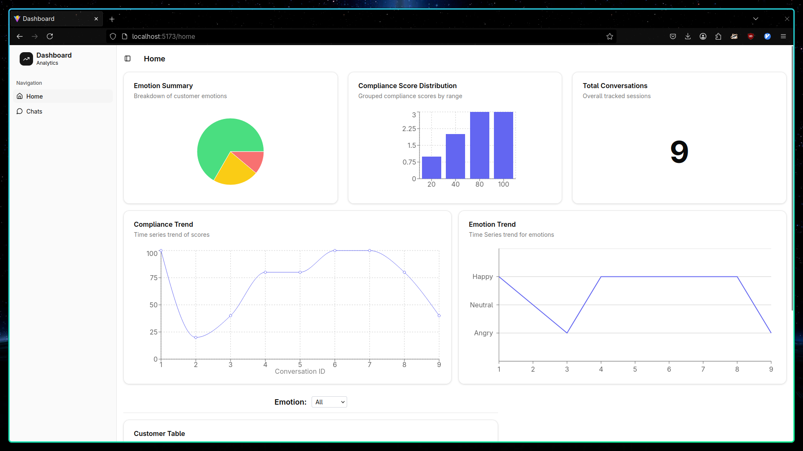
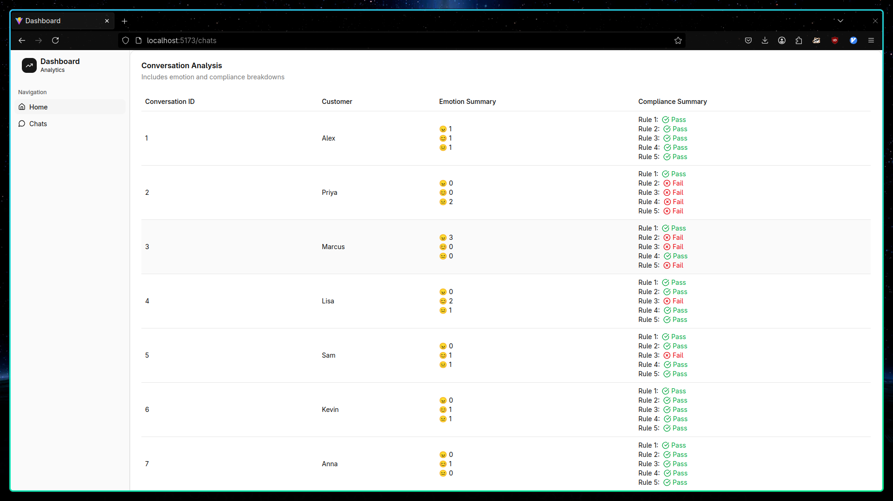

# voice-up


Dockerized 

[Video Explaination](https://youtu.be/SydN6lQkFcM)




Prerequisites

- **Docker** (with Docker Compose support): [Download Docker](https://www.docker.com/products/docker-desktop)
- **Git**: [Download Git](https://git-scm.com/)

Clone the Repository

1. Clone this repository to your local machine:

  ```bash
   https://github.com/mayureshsaitwal/voice-up.git
   cd voice-up
  ```

Environment Setup

2. Create a `.env` file in the root of the project directory. You can use the provided `.env.example` as a template.
```bash
   cp .env.example .env
```
   Fill in the necessary environment variables in the `.env` file (such as your **Postgres credentials**).

   Example `.env` file:
   ```bash
    POSTGRES_USER=myuser
    POSTGRES_PASSWORD=mypassword
    POSTGRES_DB=mydatabase
    DB_HOST=db
    DB_PORT=5432
    LLM_API=API
```

  3. Build and start the application using **Docker Compose**:
```bash
docker-compose up --build
```

 #### IMP: 
 After running docker run migrations and load mock_convesation 
 and for that i have created a simple script

  4. For Migrations and Loading Mock Conversations run this Script (first time only):
  ```bash
  docker-compose exec web /bin/bash entrypoint.sh
  ```

This will expose the following ports:
- **Backend (API)**: `http://127.0.0.1:8000`
- **Frontend (React)**: `http://127.0.0.1:5173`

  
